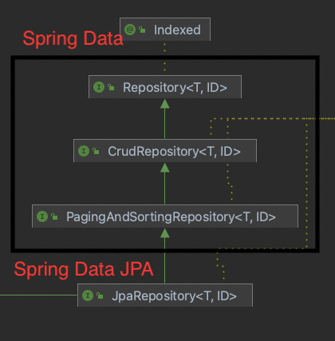

# Spring Data JPA

## 주요 라이브러리

- 핵심 라이브러리
    - 스프링 MVC
    - 스프링 ORM
    - JPA, 하이버네이트
    - Spring Data JPA
- 기타 라이브러리
    - H2 데이터베이스 클라이언트
    - 커넥션 풀: 부트 기본은 HikariCP
    - 로깅 SLF4J(인터페이스) & LogBack(구현체)
    - 테스트

- 테스트 라이브러리
    - junit: 테스트 프레임워크, 스프링부트 2.2부터 junit5('jupiter') 사용
    - Mockito: 목 라이브러리
    - Assertj: 테스트 코드를 좀더 편하게 작성을 도와주는 라이브러리
    - spring-test: 스프링 통합 테스트 지원

## 공통 인터페이스 설정

**JavaConfig 설정 - 스프링 부트 사용시 생략 가능**

~~~java
@EnableJpaRepositories(basePackages = "package")
~~~

- 스프링 부트 사용 시 @SpringBootApllication의 위치를 기준으로 config 설정 됨(해당 패키지와 하위 패키지 인식)
- 만약 위치가 달라지면 @EnableJpaRepositories 필요로 됨.

**스프링 데이터 JPA가 구현클래스를 대신 생성해 준다.**

~~~
                        |<interface> ItemRepository|
                                    ↑
|Spring Data JPA| ↘︎(생성)            ↑
                     ↘              ↑
                       ->  |ItemRepository 구현 클래스|
~~~

- 스프링 데이터 JPA가 애플리케이션 로딩 시점에 해당 Repository의 구현클래스를 만들어준다.
- @Repository 어노테이션 생략 가능
  - 컴포넌트 스캔을 스프링 데이터 JPA가 자동으로 처리
  - JPA 예외를 스프링 예외로 변환하는 과정도 자동으로 처리

**공통 인터페이스 구성**

**제네릭 타입**

- T: 엔티티
- ID: 엔티티의 식별자 타입
- S: 엔티티와 그 자식 타입

**주요 메서드**

- save(S): 새로운 엔티티는 저장하고 이미 있는 엔티티는 병합한다.
- delete(T): 엔티티 하나를 삭제한다. 내부에서 EntityManager.remove() 호출
- findById: 엔티티 하나를 조회한다. 내부에서 EntityManager.find() 호출
- getOne(ID): 엔티티를 프록시로 조회한다. 내부에서 EntityManger.getReference() 호출
- findAll(..): 모든 엔티티를 조회한다. 정렬(sort)이나 페이징(Pageable) 조건을 파라미터로 제공할 수 있다.

JpaRepository는 대부분의 공통메서드를 제공한다.

## 쿼리 메소드 기능

- 메소드 이름으로 쿼리생성
- NamedQuery
- @Query - Repository 메소드 위에 쿼리정의
- 파라미터 바인딩
- 반환 타입
- 페이징과 정렬
- 벌크성 수정 쿼리
- @EntityGraph

스프링 데이터 JPA가 제공하는 기능

#### **쿼리 메소드 3가지**

- 메소드 이름으로 쿼리 생성
- 메소드 이름으로 JPA NamedQuery 호출
- @Query 어노테이션을 사용해서 Repository 인터페이스에 쿠러 직접 정의

### 메소드 이름으로 쿼리 생성

~~~java
ex)
List<Member> findByUsernameAndAgeGreaterThan(String username, int age);

JPQL
select
        member0_.member_id as member_i1_0_,
        member0_.age as age2_0_,
        member0_.team_id as team_id4_0_,
        member0_.username as username3_0_ 
    from
        member member0_ 
    where
        member0_.username=? 
        and member0_.age>?
~~~

스프링 데이터  JPA Repository에 상단의 예시와같이 조건을 넣어서 추상메소드를 만들면 JPA가 알아서 해당 메소드를 구현해준다.

**프로퍼티 명을 제대로 명시해줘야한다. 프로그램에서 잘못된 프로퍼티를 인식할수 없다고 하는 오류가 발생한다.**

**스프링 데이터 JPA가 제공하는 쿼리 메소드 기능**

- 조회: find...By, read...By, query...By, get..By
  - 예) findHelloBy처럼 ...에 식별하기 위한 내용(설명)이 들어가도 된다.
- COUNT: count..By 반환타입 long
- EXISTS: exists...By 반환타입 boolean
- 삭제: delete...By, remove...By 반환타입 long
- DISTINCT: findDistinct, findMemberDistinctBy
- LIMIT: findFist3, findFist, findTop, findTop3

**참고: 이 기능은 엔티티의 필드명이 변경되면 인터페이스에 정의한 메서드 이름도 꼭 함께 변경해야 한다. 그렇지 않으면 애플리케이션을 시작하는 시점에 오류가 발생한다.  이렇게 애플리케이션 로딩시점에 오류를 인지할 수 있는 것이 스프링데이터 JPA의 매우 큰 장점이다.**

### JPA NamedQuery

실무에서는 많이 안쓰이므로 예시만 남겨둔다.

~~~java
Entity
@NamedQuery(
		name = "Member.findByUsername",
  	query = "select m from Member m where m.username = :username"
)

Repository
  
//@Query(name = "Member.findByUsername") 없어도 동작한다.
//NamedQuery가 존재하면 NamedQuery를 먼저 찾아서 동작한다.
List<Member> findByUsername(@Param("username") String username);
~~~

장점: namedQuery의 query에 JPQL을 잘못 적으면 문법오류를 알려줌.

## @Query, Repository 메소드에 쿼리 정의하기

메소드에 JPQL 쿼리를 작성한다.

~~~java
 Repository

@Query("select m from Member m where m.username = :username and m.age = :age")
List<Member> findUser(@Param("username") String username, @Param("age") int age);
~~~

- 실행할 메서드에 정적쿼리를 직접 작성하므로 이름없는 NamedQuery라 할 수 있다.
- **JPA NamedQuery처럼 애플리케이션 실행 시점에 문법 오류를 발견할 수 있다.(매우 큰 장점!)**

**참고: 실무에서는 메소드 이름으로 쿼리 생성 기능은 파라미터가 증가하면 메서드 이름이 매우 지저분해진다. 따라서 @Query기능을 자주 사용하게 된다.**

## @Query, 값, DTO 조회하기

**단순히 값 하나를 조회**

~~~java
@Query("select m.username from Member m")
List<String> findUsernameList();
~~~

JPA값 타입(@Embedded)도 이 방식으로 조회할 수 있다.

**DTO로 직접 조회**

~~~java
@Query ("select new package.MemberDto(m.id, m.username, t.name) from Member m join m.team t")
List<MemberDto> findMemberDto();
~~~

**주의! DTO로 직접 조회하려면 JPA의 'new'명령어를 사용해야 한다. 그리고 다음과 같이 생성자가 맞는 DTO가 필요하다.**

## 파라미터 바인딩

- 위치기반
- 이름 기반

~~~sql
select m from Member m where m.username = ?0 //위치 기반
select m from Member m where m.username = :username//이름 기반
~~~

**파라미터 바인딩**

~~~java
@Query("select m from Member m where m.username = :name")
Member findMembers(@Param("name") String username);
~~~

**참고: 코드 가독성과 유지보수를 위해 이름 기반 파라미터를 사용하자!**

**컬렉션 파라미터 바인딩**

Collection 타입으로 in절 지원

~~~java
@Query("select m from Member m where m.username in :names")
List<Member> findByNames(@Param("names") Collection<String> names);
~~~

## 반환 타입

JPA에서는 반환타입을 유연하게 설정할 수 있다.

~~~java
List<Member> findListByUsername(String username); //컬렉션
Member findMemberByUsername(String username); //단건
Optional<Member> findOptionalByUsername(String username); //단건 Optional
~~~

**참고: 왠만하면 단건조회를 할때 Optional로 감싸서 반환하도록 하자, 왜냐하면 조회를 했을 때 데이터가 없다면 그냥 반환할 시 Spring Data JPA가 NullExecption오류를 한번 감싸서 null로 반환해주지만 Optional로 반환하면 한번 감싸주기 때문에 더 안전하다.**

**조회결과나 많거나 없을 때**

- 컬렉션
  - 결과 없음: 빈 컬렉션을 반환한다.
- 단건 조회
  - 결과 없음: null 반환
  - 결과가 2건 이상: NonUniqueResultException 예외를 발생한다.

## 순수 JPA 페이징과 정렬

**페이징 정렬 예시**

- 검색 조건: 나이가 10살
- 정렬 조건: 이름으로 내림차순
- 페이징 조건: 첫 번째 페이지, 페이지당 보여줄 데이터는 3건

~~~java
public List<Member> findByPage(int age, int offset, int limit) {
        return em.createQuery("select m from Member m where m.age = :age order by m.username desc ")
                .setParameter("age", age)
                .setFirstResult(offset)
                .setMaxResults(limit)
                .getResultList();
    }

    public long totalCount(int age) {
        return em.createQuery("select count(m) from Member m where m.age = :age", Long.class)
                .setParameter("age", age)
                .getSingleResult();
    }
~~~

## Spring Data JPA 페이징과 정렬

**페이징과 정렬 파라미터**

- org.springframework.data.domain.Sort: 정렬 기능
- org.springframework.data.domain.Pageable: 페이징 기능(내부에 Sort 포함)

**특별한 반환 타입**

- org.springframework.data.domain.Page: 추가 count 쿼리 결과를 포함하는 페이징
- org.springframework.data.domain.Slice: 추가 count 쿼리 없이 다음 페이지만 확인 가능(내부적으로 limit + 1조회)
  - ex) 모바일의 더보기 같은 것들
- List (자바 컬렉션): 추가 count 쿼리 없이 결과만 반환

**페이징과 정렬 사용 예제**

~~~java
Page<Member> findByUsername(String name, Pageable pageable);
//count 쿼리 사용
Slice<Member> findByUsername(String name, Pageable pageable);
//count 쿼리 사용 안함
List<Member> findByUseranme(String name, Pageable pageable);
//count 쿼리 사용 안함
List<Member> findByUsername(String name, Sort sort);
~~~

**Paging 예제**

~~~java
Repository:
Page<Member> findByUsername(String name, Pageable pageable);
//Paging도 되고, count 쿼리가 알아서 만들어짐
        
Test:
PageRequest pageRequest = PageRequest.of(0, 3, Sort.by(Sort.Direction.DESC, "username"));

Page<Member> page = memberRepository.findByAge(age, pageRequest);

assertThat(content.size()).isEqualTo(3); //보여주는 데이터 개수
assertThat(page.getTotalElements()).isEqualTo(5); // 총 데이터 개수
assertThat(page.getNumber()).isEqualTo(0); //페이지 번호
assertThat(page.getTotalPages()).isEqualTo(2); //총 페이지 개수
assertThat(page.isFirst()).isTrue(); //첫번째 페이지인지 확인
assertThat(page.hasNext()).isTrue(); //다음 페이지가 존재하는지 확인
~~~

**count 쿼리시 성능이 느려진다면 count query를 따로 분리한다.**

~~~java
@Query(value = "select m from Member m left join m.team",
       countQuery = "select count (m) from Member m")
			 // count쿼리 분리
Page<Member> findByAge(int age, Pageable pageable);
~~~

#### 실무 팁!!: API로 반환값을 제공할 때는 Entity가 아니라 DTO로 반환해서 제공해야 된다.

~~~java
Page<MemberDto> toMap = page.map(member -> new MemberDto(member.getId(), member.getUsername(), null));
~~~

map을 사용해서 DTO로 다시 객체를 생성해서 반환한다.

**참고: Page는 1부터 시작이 아니라 0부터 시작이다.**

**Slice 예제**

~~~java
Repository:
Slice<Member> findSliceByAge(int age, Pageable pageable);

Test:
PageRequest pageRequest = PageRequest.of(0, 3, Sort.by(Sort.Direction.DESC, "username"));

Slice<Member> slice = memberRepository.findSliceByAge(age, pageRequest);

//then
List<Member> sliceContent = slice.getContent();

assertThat(sliceContent.size()).isEqualTo(4); //보여주는 데이터 개수
//        assertThat(slice.getTotalElements()).isEqualTo(5); // 총 데이터 개수
assertThat(slice.getNumber()).isEqualTo(0); //페이지 번호
//        assertThat(slice.getTotalPages()).isEqualTo(2); //총 페이지 개수
assertThat(slice.isFirst()).isTrue(); //첫번째 페이지인지 확인
assertThat(slice.hasNext()).isTrue(); //다음 페이지가 존재하는지 확인

~~~

**List 예제**

~~~java
List<Member> findListByAge(int age, Pageable pageable);
~~~

## 벌크성 수정 쿼리

**JPA를 사용한 벌크성 수정 쿼리**

~~~java
public int bulkAgePlus(int age) {
        return em.createQuery("update Member m set m.age = m.age + 1 where m.age >= :age")
                .setParameter("age", age)
                .executeUpdate();
}
~~~

executeUpdate()는 응답값의 개수를 반환해준다.

**Spring Data JPA를 사용한 벌크성 수정 쿼리**

~~~java
@Modifying
@Query("update Member m set m.age = m.age + 1 where m.age >= :age")
int bulkAgePlus(@Param("age") int age);
~~~

@Modifying이 있어야, JPA의 executeUpdate()를 실행한다. 그리고 Modifying을 통해 변경한다는 것을 정의할 수 있다.

JPQL을 적으면 JPQL메소드가 실행되기전에 먼저 flush를하고 JPQL 메소드가 실행된다.

**문제점: 벌크성 쿼리를 전송하면 영속성 컨텍스트를 거치고 가는게 아니라 DB로 바로 전송되기 때문에 영속성 컨텍스트의 Data와 DB에 저장되어있는 Data가 상이 할 수 있다. 벌크 연산을 수정하고 logic이 끝나면 상관이 없는데, 만약에 같은 트랜잭션 안에서 다른작업을 하게 되면 문제가 야기된다.**

ex)

~~~ java
memberRepository.save(new Member("member5", 40));

int resultCount = memberRepository.bulkAgePlus(20); //벌크 연산 실행

Optional<Member> member5 = memberRepository.findOptionalByUsername("member5");
System.out.println("member5.get() = " + member5.get());

실행결과: 
DB: member5: 41
Code: member5.get() = Member(id=5, username=member5, age=40)
~~~

**해결방법: 벌크성 쿼리를 전송한 뒤에 EntityManager를 초기화 한다.**

방법1: 벌크연산을 한후 영속성 컨텍스트를 초기화 해준다.

~~~java
@PersistenceContext
EntityManager em;

memberRepository.save(new Member("member5", 40));

int resultCount = memberRepository.bulkAgePlus(20); //벌크 연산 실행
em.clear();

Optional<Member> member5 = memberRepository.findOptionalByUsername("member5");
System.out.println("member5.get() = " + member5.get());

실행결과: 
DB: member5: 41
Code: member5.get() = Member(id=5, username=member5, age=41)
~~~

방법2: @Modifying() 어노테이션에 clearAuomatically 옵션을 넣어준다.

~~~java
@Modifying(clearAutomatically = true)
@Query("update Member m set m.age = m.age + 1 where m.age >= :age")
int bulkAgePlus(@Param("age") int age);
~~~

## @EntityGraph

연관된 엔티티들을 SQL 한번에 조회

member -> team은 지연로딩 관계이다. 따라서 다음과 같이 team의 데이터를 조회할 때 마다 쿼리가 실행된다(N+1 문제 발생)

~~~java
@Test
    public void findMemberLazy() {
        //given
        //member1 -> teamA
        //member2 -> teamB

        Team teamA = new Team("teamA");
        Team teamB = new Team("teamB");
        teamRepository.save(teamA);
        teamRepository.save(teamB);

        Member member1 = new Member("member1", 10, teamA);
        Member member2 = new Member("member2", 10, teamB);
        memberRepository.save(member1);
        memberRepository.save(member2);

        em.flush();
        em.clear();
        
        //when N + 1문제
        //select Member 1
        List<Member> members = memberRepository.findAll();

        for (Member member : members) {
            System.out.println("member.getUsername() = " + member.getUsername());
            System.out.println("member.getTeam().getClass() = " + member.getTeam().getClass());
            System.out.println("member.getTeam().getName() = " + member.getTeam().getName());
        }
    }
~~~

### N+1 문제

**N+1 문제는 위 처럼 Member를 한번만 조회해서 Data가 N개가 조회됬는데, Member의 Team정보를 확인하려할 때마다 Team 조회 쿼리가 또 N개 만큼 발생되는 문제를 말한다.**

### 해결 방법

1. Fetch Join 사용

   Fetch Join은 연관관계가 맺어진 모든 Entity 즉 객체 그래프를 모두 다 Join해서 한번에 다 가져온다.

   ~~~java
   @Query("select m from Member m left join fetch m.team")
   List<Member> findMemberByFetchJoin();
   ~~~

2. EntityGraph 사용
   
   EntityGraph도 결국엔 내부적으로는 fetch join을 하는거다.
   ~~~java
   @Override
   @EntityGraph(attributePaths = {"team"})
   List<Member> findAll();
   ~~~

## JPA Hint & Lock

### JPA Hint

JPA 쿼리 힌트(SQL 힌트가 아니라 JPA 구현체에게 제공하는 힌트)

**쿼리힌트 사용**

~~~java
@QueryHints(value = @QueryHint(name = "org.hibernate.readOnly", value = "true"))
Member findReadOnlyByUsername(String username);
~~~

**쿼리 힌트 사용 확인**

~~~java
@Test
public void queryHint() {
        //given
        Member member1 = new Member("member1", 10);
        memberRepository.save(member1);
        em.flush();
        em.clear();

        //when
        Member findMember = memberRepository.findReadOnlyByUsername("member1");
        findMember.setUsername("member2");
				//변경감지를 할때 메모리에 원본 객체와 변경된 객체 2개를 저장해둔다. 그러므로 약간의 메모리 낭비가 생길 수 있다. 그래서 JPA Hint를 써서 이 코드는 수정을 안하고, 조회만 한다는 Hint를 설정하여, 메모리 낭비를 줄여준다.
        em.flush();
}
~~~

findMember.setUseranme밑에 주석을 달았지만 막상 실무에서 다이나믹하게 성능이 최적화가 되지는 않는다고 한다. 그러므로 성능 Test를 직접해본 뒤 적용을 생각해보자

### JPA Lock

개념이 어려우니 JPA책 참고 - 딱히 실무에서 쓸일이 많지 않음

**Lock 사용**

~~~java
@Lock(LockModeType.PESSIMISTIC_WRITE)
List<Member> findLockByUsername(String username);
~~~

## 확장기능

### 사용자 정의 Repository 구현

- 스프링 데이터 JPA Repository는 인터페이스만 정의하고 구현체는 스프링이 자동 생성
- 스프링 데이터 JPA가 제공하는 인터페이스를 직접 구현하면 구현해야 하는 기능이 너무 많다.
- 다양한 이유로 인터페이스의 메소드를 직접 구현하고 싶다면?
- JPA 직접 사용(EntityManager)
- 스프링 JDBC Template 사용
- MyBatis 사용
- 데이터베이스 커넥션 직접 사용 등
- Querydsl 사용 (실무에서 제일 많이 쓰는 거 같음)

**사용자 정의 인터페이스**

~~~java
public interface MemberRepositoryCustom{
	List<Member> findMemberCustom();
}
~~~

**사용자 정의 구현 클래스**

- 규칙: 자신이 만든 Repository 인터페이스 이름 + Impl
- 스프링 데이터 JPA가 인식해서 스프링 빈으로 등록

**참고: 항상 사용자 정의 Repository가 필요한 것은 아니다. 그냥 임의의 Repository를 만들어도 된다. 예를 들어 MemberQueryRepository를 그냥 인터페이스 가인 클래스로 만들고 스프링 빈으로 등록해서 그냥 직접 사용해도 된다. 물론 이경우 스프링 데이터 JPA와는 아무런 관계없이 별도로 동작한다.**

**실무에서 핵심비즈니스로 관련된 Repository랑 단순 화면용 Repository를 왠만하면 분리해서 사용하자.**